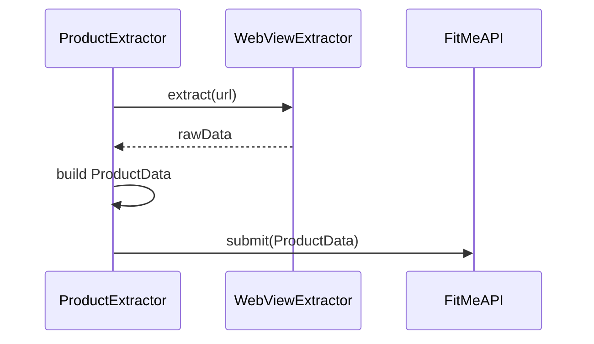

# ProductExtractor

## Purpose

`ProductExtractor` orchestrates the end‑to‑end extraction workflow. It receives a product URL, delegates the heavy‑lifting to `WebViewExtractor`, handles fallback strategies, builds the domain model (`ProductData`), and forwards the result to `FitMeAPI` for further processing.

## Core Responsibilities

1. **Entry Point** – Public method `extract(url: URL) async throws -> ProductData`.
2. **WebView Extraction** – Calls `WebViewExtractor.extract(url:)` to obtain raw JSON/DOM data.
3. **Fallback Logic** – If the WebView extraction returns incomplete data, performs a plain `URLSession` HTML fetch and parses minimal fields.
4. **Data Normalisation** – Maps raw dictionary keys to the strongly‑typed `ProductData` model defined in `Models.swift` (title, brand, price, images, sizes, etc.).
5. **Error Handling** – Distinguishes between network errors, parsing errors, and site‑specific extraction failures, bubbling appropriate `ExtractionError` values.
6. **Integration with FitMeAPI** – After building `ProductData`, calls `FitMeAPI.shared.extractProduct(fromImage:)` when needed, or directly forwards the model to other services.

## High‑Level Flow (text diagram)

```
[ProductExtractor]
   |
   |-- request URL
   |-- invoke WebViewExtractor
   |      |
   |      `-- returns raw JSON
   |-- validate & enrich data
   |-- construct ProductData
   |-- optional backend image extraction
   V
[ProductData] → FitMeAPI
```

## Mermaid Diagram



---
*All implementation resides in `ios/FitMe/Services/ProductExtractor.swift`. The file also defines the `ExtractionError` enum used throughout the extraction pipeline.*
