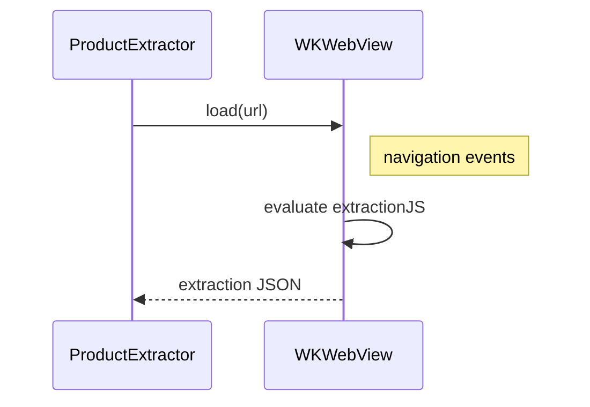

# WebViewExtractor

## Purpose

`WebViewExtractor` is responsible for loading the product page inside a `WKWebView`, injecting JavaScript (`extractionJS`) that extracts product metadata (JSON‑LD, `__NEXT_DATA__`, DOM elements) and returning the raw data to the caller.

## Key Responsibilities

1. **WebView Lifecycle** – Initialise, configure (e.g., `allowsBackForwardNavigationGestures = false`), and clean up a `WKWebView` instance.
2. **Navigation** – Load the supplied URL and monitor navigation events (`didFinish`, `didFail`).
3. **JavaScript Injection** – Execute `extractionJS` via `evaluateJavaScript`. The script gathers:
   - Product title, brand, price, images.
   - Structured data (`application/ld+json`).
   - Platform‑specific fallbacks for sites that hide data behind lazy‑loaded scripts.
4. **Polling & Timeout** – Re‑evaluate the script until a non‑empty result is returned or a timeout occurs (`maxRetries`).
5. **Result Parsing** – Convert the JSON string returned from the WebView into a Swift dictionary and forward it upstream.

## Architecture Diagram (text)

```
[WebViewExtractor]
   |
   |-- creates WKWebView
   |-- loads URL
   |-- injects extractionJS
   |-- polls for result
   V
[Raw Extraction JSON]
```

## Mermaid Diagram



---
*All code is located in `ios/FitMe/Services/WebViewExtractor.swift`.*
